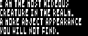
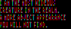

# RGB Subpixels tool

Turn (grayscale) images into subpixels and vice-versa!

## Drop a file on .image_to_subpixels_*scale*.bat
>Or use `python rgb_converter.py [FILENAME] vscale`

 → 

Pixels will be averaged vertically 3 by 3 (loss of data).

## Drop a file on .image_to_subpixels_*tall*.bat 
>Or use `python rgb_converter.py [FILENAME]`

 → 

Pixels will not be averaged, but the image will be stretched as a result.

## Drop a file on .subpixels_to_image_*greyscale*.bat

>Or use `python rgb_converter.py [FILENAME] reverse greyscale vscale` 

 →  

The greyscale version will generate back the original image/sprite (unless loss of information).

## Drop a file on .subpixels_to_image_*color*.bat

>Or use `python rgb_converter.py [FILENAME] reverse colored vscale`

 → 

The RGB version is useful to zoom in (as the subpixel version is not zoomable).

Removing vscale will just keep the same height. Can look funny, but no loss of data.

----

Other options when turning an image into subpixels:

`r`, `g` or `b` (multiples) will create a new output shifted by respectively zero, one or two subpixels. (Hence, the first leftmost subpixel of the image is either red, green or blue.)

If several out of `r`,`g`,`b` are mentioned, `combined` will allow them to be output in the same .gif. Otherwise, they will be separate images.